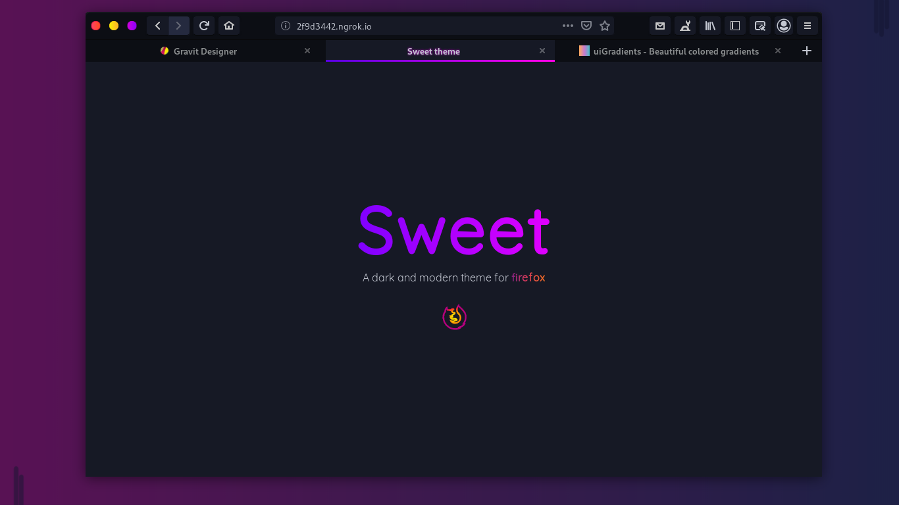

# FireDragon SWEET theme

<br>

**A SWEET theme for FireDragon**

This theme follows lastest Sweet style.



## Description

This is a bunch of CSS code to make FireDragon look closer to GNOME's native apps.

### Firefox versions support

This `firedrgon` branch of this repo supports the current latest version of FireDragon stable release `101.0.1`.

## Installation

### Installation script
1. Clone this repo and enter folder:
	
	```sh
	git clone  https://github.com/KevinNadar/sweet-firefox-theme.git && cd sweetfirefox-theme
	# You're in the master branch by default
	git checkout firedragon # Switch to firedragon branch 
	```

3. Run installation script

	#### Auto install script
	
	This script will lookup FireDragon profiles location and enable a theme variant for your GTK theme if it exists.
	```sh
	./scripts/auto-install.sh
	```
	#### Install script
	```sh
	./scripts/install.sh # Standard
	./scripts/install.sh -f
	```

	##### Script options
	- `-f <firedragon_folder_path>` *optional*
		- Set custom Firefox folder path, for example `~/.mozilla/icecat/`.
		- Default: `~/.firedragon`

	- `-p <profile_name>` *optional*
		- Set custom profile name, for example `e0j6yb0p.default-nightly`.
		- Default: All the profiles found in the firedragon folder
	
### One command curled script

You can also install this theme with one command:

```sh
curl -s -o- https://raw.githubusercontent.com/KevinNadar/sweet-firefox-theme/firedragon/scripts/install-by-curl.sh | bash
```

It will download the latest version of the theme and run the auto installation script for you.

### Manual installation
1. Go to `about:support` in Firedragon.

2. Application Basics > Profile Directory > Open Directory.

3. Open directory in a terminal.

4. Create a `chrome` directory if it doesn't exist:

	```sh
	mkdir -p chrome
	cd chrome
	```

5. Clone this repo to a subdirectory:

	```sh
	git clone https://github.com/KevinNadar/sweet-firefox-theme.git
	```

6. Create single-line user CSS files if non-existent or empty (at least one line is needed for `sed`):

	```sh
	[[ -s userChrome.css ]] || echo >> userChrome.css
	```

7. Import this theme at the beginning of the CSS files (all `@import`s must come before any existing `@namespace` declarations):

	```sh
	sed -i '1s/^/@import "sweet-firefox-theme\/userChrome.css";\n/' userChrome.css
	```

8. Symlink preferences file:

	```sh
	cd .. # Go back to the profile directory
	ln -fs chrome/sweet-firefox-theme/configuration/user.js user.js
	```

9. Restart Firefox.

10. Open Firefox customization panel and move the new tab button to headerbar.

11. Be happy with your new gnomish Firefox.

### Required Firedragon preferences
We provide a **user.js** configuration file in `configuration/user.js` that enable some preferences required by this theme to work. 

You should already have this file installed if you followed one of the installation methods, but in any case be sure this preferences are enabled under `about:config`:

- `toolkit.legacyUserProfileCustomizations.stylesheets`

	This preference is required to load the custom CSS in Firedragon, otherwise the theme wouldn't work.

- `svg.context-properties.content.enabled`

	This preference is required to recolor the icons, otherwise you will get black icons everywhere.

> For other non essential preferences checkout `configuration/user.js`.

Also though is not obligatory, some weird issues might happen if you don't use the Firedragon's default/system theme because the theme is never tested against the Firefox's light or dark theme.

## Updating

You can follow the installation script steps again to update the theme.

## Uninstalling
1. Go to your profile folder. (Go to `about:support` in Firedragon > Application Basics > Profile Directory > Open Directory)
2. Remove `chrome` folder.

<!--

## Enabling optional features
Optional features can be enabled by creating new `boolean` preferences in `about:config`.

1. Go to the `about:config` page 
2. Type the key of the feature you want to enable
3. Set it as a `boolean` and click on the add button
4. Restart Firedragon

### Features

- **Hide single tab** `gnomeTheme.hideSingleTab`

	Hide the tab bar when only one tab is open.

	> **Note:** You should move the new tab button somewhere else for this to work, because by default it is on the tab bar too. See [#54](https://github.com/rafaelmardojai/firefox-gnome-theme/issues/54).

- **Normal width tabs** `gnomeTheme.normalWidthTabs`

	Use normal width tabs as default Firefox.

- **Bookmarks toolbar under tabs** `gnomeTheme.bookmarksToolbarUnderTabs`

	Move Bookmarks toolbar under tabs.

- **Active tab contrast** `gnomeTheme.activeTabContrast`

	Add more contrast to the active tab.

- **System icons** `gnomeTheme.systemIcons`

	Use system theme icons instead of Adwaita icons included by theme.

	> **Note:** This feature has a [known color bug](#icons-color-broken-with-system-icons).

- **Symbolic tab icons** `gnomeTheme.symbolicTabIcons`

	Make all tab icons look kinda like symbolic icons.

- **Hide WebRTC indicator** `gnomeTheme.hideWebrtcIndicator`

	Hide redundant WebRTC indicator since GNOME provides their own privacy icons in the top right.

- **Drag window from headerbar buttons** `gnomeTheme.dragWindowHeaderbarButtons`

	Allow draging the window from headerbar buttons.

	> **Note:** This feature is BUGGED. It can activate the button with unpleasant behavior.
-->

## Known bugs

### CSD have sharp corners
See upstream [bug](https://bugzilla.mozilla.org/show_bug.cgi?id=1408360).

#### Wayland fix:
1. Go to the `about:config` page
2. Search for the `layers.acceleration.force-enabled` preference and set it to true.
3. Now restart Firedragon, and it should look good!

#### X11 fix:
1. Go to the `about:config` page 
2. Type `mozilla.widget.use-argb-visuals`
3. Set it as a `boolean` and click on the add button
4. Now restart Firedragon, and it should look good!

### Icons color broken with System icons
Icons might appear black where they should be white on some systems. I have no idea why, but you can adjust them directly in the `system-icons.css` file, look for `--gnome-icons-hack-filter` & `--gnome-window-icons-hack-filter` vars and play with css filters.

## Development

If you wanna mess around the styles and change something, you might find these
things useful.

To use the Inspector to debug the UI, open the developer tools (F12) on any
page, go to options, check both of those:

- Enable browser chrome and add-on debugging toolboxes
- Enable remote debugging

Now you can close those tools and press Ctrl+Alt+Shift+I to Inspect the browser
UI.

Also you can inspect any GTK3 application, for example type this into a terminal
and it will run Epiphany with the GTK Inspector, so you can check the CSS styles
of its elements too.

```sh
GTK_DEBUG=interactive epiphany
```

Feel free to use any parts of my code to develop your own themes, I don't force
any specific license on your code.

## Credits
This project is a fork of [firefox-gnome-theme](https://github.com/rafaelmardojai/firefox-gnome-theme) by **[Rafael Mardojai CM](https://github.com/rafaelmardojai)**. Based on **[Luna Kurame](https://github.com/lunakurame/firefox-gnome-theme)**'s original work. This project contains the **sweet** `/theme` directory from [this repo](https://github.com/EliverLara/firefox-sweet-theme).

<!-- TODO: modify link -->